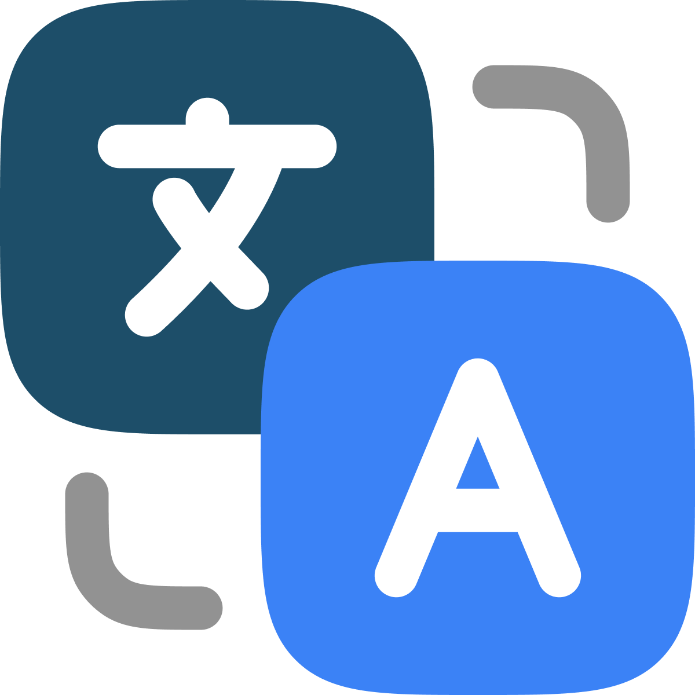
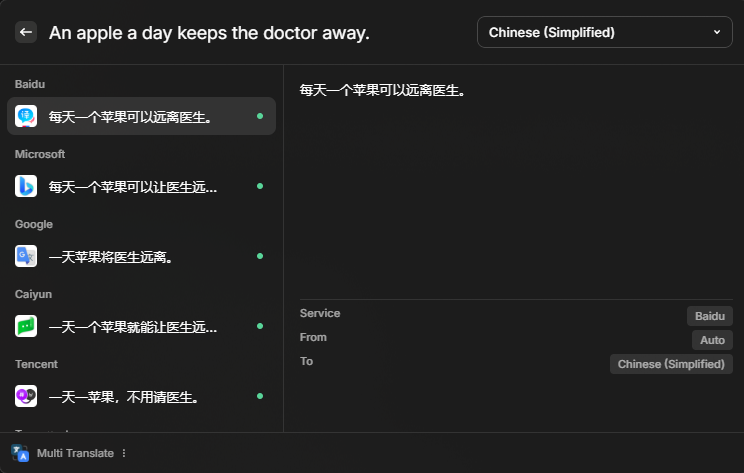

<p align="center">

</p>

<h1 align="center">
MultiTranslate
</h1>

<p align="center">
A Raycast plugin that translates text using multiple translation services.
</p>



## Supports

### Without configuration
- [Youdao](https://fanyi.youdao.com/)
- [Google](https://translate.google.com/)
- [Baidu](https://fanyi.baidu.com/)
- [Bing](https://www.bing.com/translator)
- [DeepL](https://www.deepl.com/translator)
- [Tencent](https://fanyi.qq.com/)
- [Transmart](https://transmart.qq.com)
- [Caiyun](https://fanyi.caiyunapp.com/)
- [Volcengine](https://translate.volcengine.com/)

> [!IMPORTANT]
> The above services are unofficial. Please use with discretion.

## Language Codes List

+ I can only ensure the common languages are supported.
+ Each service may support different languages.

```typescript
export const languageCodesArr = [
  'auto',
  'zh',
  'zh_hant',
  'yue',
  'en',
  'ja',
  'ko',
  'fr',
  'es',
  'ru',
  'de',
  'it',
  'tr',
  'pt_pt',
  'pt_br',
  'vi',
  'id',
  'th',
  'ms',
  'ar',
  'hi',
  'ml',
  'mn_cy',
  'mn_mo',
  'km',
  'nb_no',
  'nn_no',
  'fa',
  'sv',
  'pl',
  'nl',
  'uk',
  'he',
  'bg',
  'cs',
  'da',
  'et',
  'fi',
  'el',
  'hu',
  'lv',
  'lt',
  'ro',
  'sk',
  'sl',
] as const
```

## Thanks

[pot-app](https://github.com/pot-app/pot-desktop)
